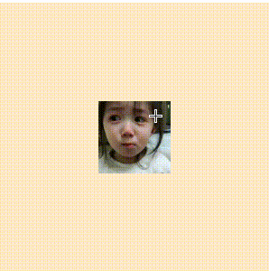

<div align="center">
  <h1>Vue Mouse Zoom</h1>
</div>

<div align="center">

基于 Vue3 的 Vue 根据鼠标位置缩放及其拖拽组件。

[](https://github.com/arco-design/arco-design/blob/main/LICENSE)
[](https://github.com/zhaoyuqiqi/mouse-zoom)

</div>

<div align="center">

[English](./README.md) | 简体中文

</div>

# 示例



# 特性

## 缩放

- 支持在滚轮滚动时根据鼠标位置进行缩放，可以做到放大某个点的效果。
- 支持 mac 触摸板缩放。

## 拖拽

- 鼠标滚轮滚动时组件进行平移，在 mac 使用触摸板时可以进行多方位的平移效果。
- 鼠标按下左键时组件可以进行拖拽操作。

## TypeScript 友好

组件是用 TypeScript 编写的，所以天然的类型友好。

# 安装

[npm package](https://www.npmjs.com/package/vue-mouse-zoom)

```bash
// npm
npm install vue-mouse-zoom

// yarn
yarn add vue-mouse-zoom

// pnpm
pnpm add vue-mouse-zoom
```

# 例子

```typescript
<script setup lang="ts">
import { VueMouseZoom } from 'vue-mouse-zoom';
</script>

<template>
  <div style="width: 300px; height: 300px;">
    <VueMouseZoom>
      
    </VueMouseZoom>
  </div>
</template>

```

## 注意 📢

被 `VueMouseZoom`组件包裹的节点必须指定宽高，不可使用 `100%`等不定宽高！！！

# Props

| 属性         | 介绍                                                       | 默认值                                      | 是否必传 |
| ------------ | ---------------------------------------------------------- | ------------------------------------------- | -------- |
| zoom         | 组件缩放的倍率，首次渲染时受限于`max-zoom`与`min-zoom`的值 | 1                                           | 否       |
| min-zoom     | 首次渲染时最小的缩放比例                                   | 0.05                                        | 否       |
| max-zoom     | 首次渲染时最大的缩放比例                                   | 4                                           | 否       |
| is-center    | 首次渲染时是否居中                                         | true                                        | 否       |
| is-draggable | 是否允许拖拽                                               | true                                        | 否       |
| zoom-handle  | 缩放时的处理函数，返回一个缩放比例                         | (e: WheelEvent, preScale: number) => number | 否       |

# 插槽

| 插槽名  | 介绍                               | 参数             | 用途                                                                              |
| ------- | ---------------------------------- | ---------------- | --------------------------------------------------------------------------------- |
| default | 组件默认插槽，内容会放置在组件内部 | isWheel: boolean | 当组件缩放、拖拽过程出现性能问题时候，可以使用该参数来移除组件内部的 dom 优化性能 |

# 事件

| 事件名         | 介绍                         | 参数         | 用途                               |
| -------------- | ---------------------------- | ------------ | ---------------------------------- |
| on-zoom-update | 当缩放比例改变时会触发该事件 | scale:number | 可以根据该事件获取到当前的缩放倍率 |

# 浏览器兼容性

与 `Vue3` 支持一致
